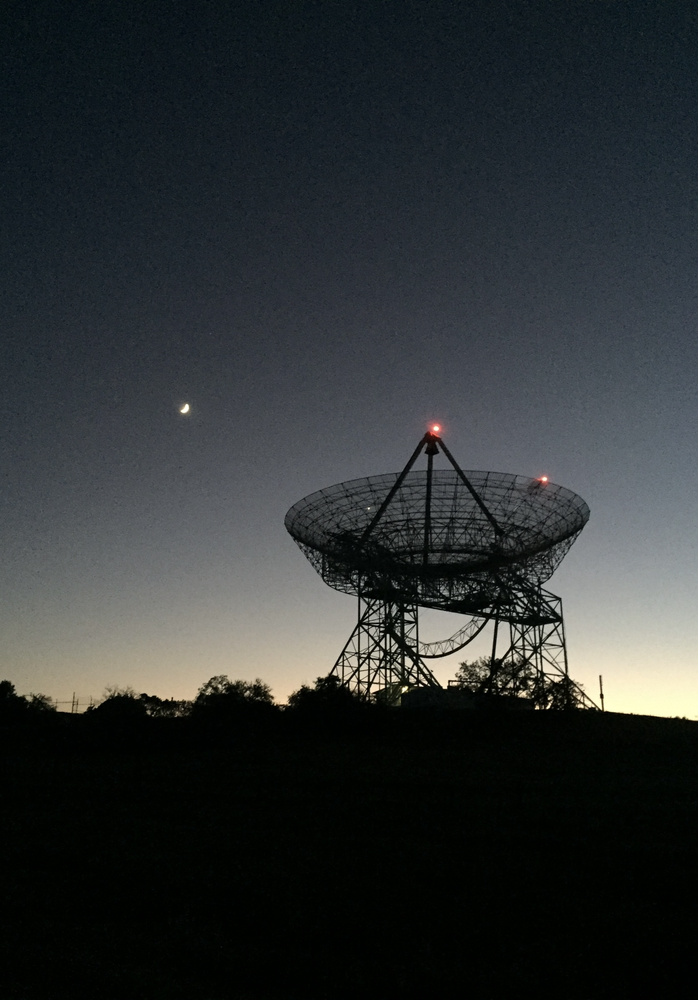
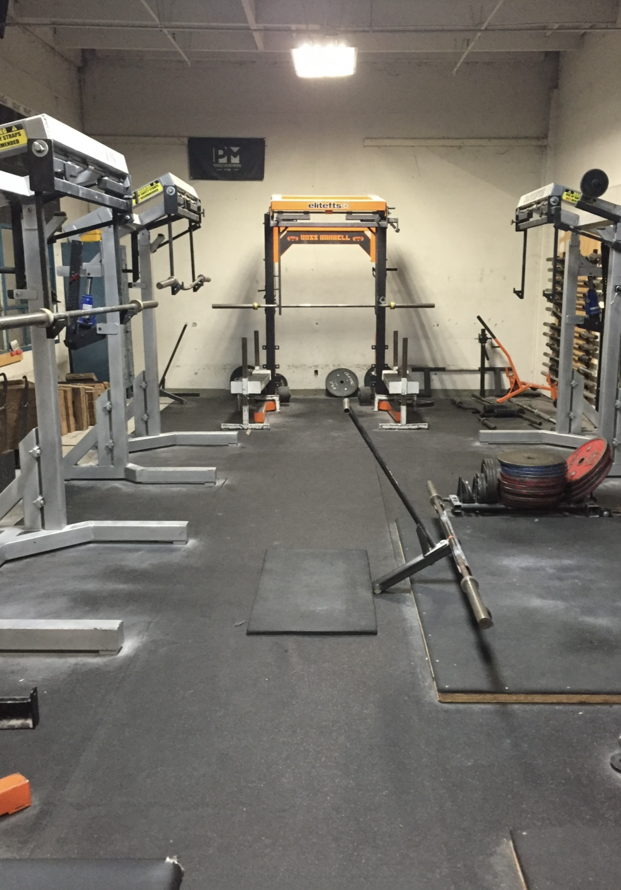
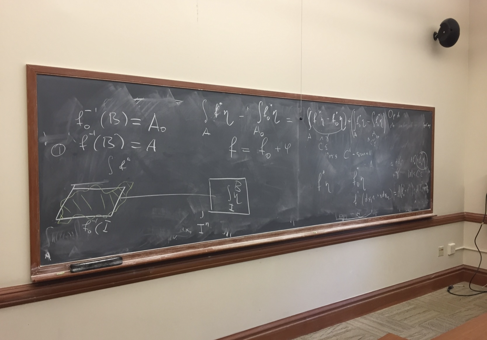
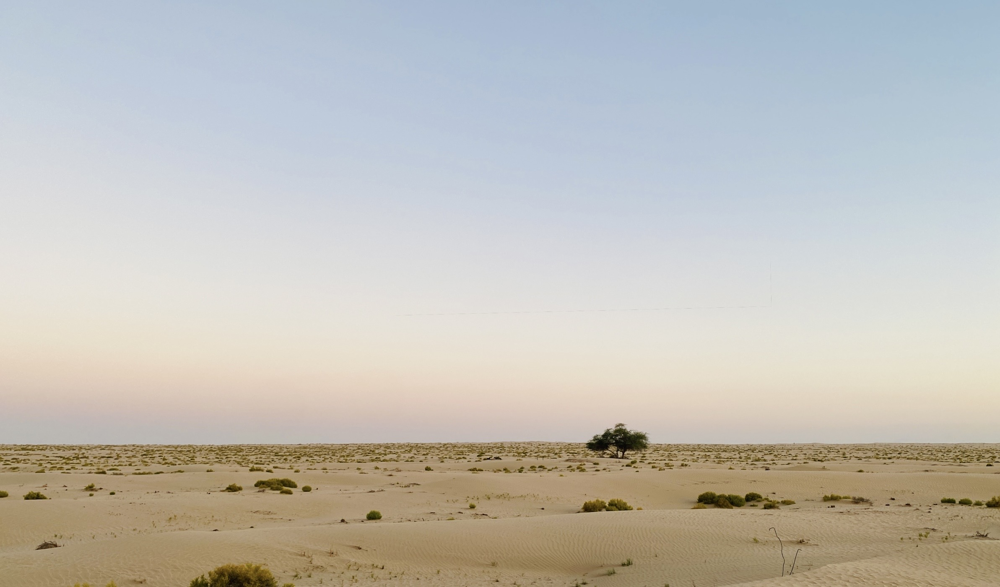

---
title: Personal Interests
---

Below capture some of my fond memories.

```{=html}
<style>
.photo-slideshow {
  display: flex;
  align-items: center;
  justify-content: center;
  gap: 1rem;
  margin: 1.5rem auto;
  width: 100%;
}

.photo-slides {
  width: min(100%, 750px);
  text-align: center;
}

.photo-slide {
  display: none !important;
  width: auto !important;
  height: auto !important;
  margin: 0 auto !important;
  object-fit: contain;
}

/* Only the currently selected photograph is visible */
.photo-slide.active {
  display: block !important;
}

/* Portrait photographs */
.photo-slide.portrait {
  max-width: min(100%, 420px) !important;
  max-height: 650px;
}

/* Landscape photographs */
.photo-slide.landscape {
  max-width: min(100%, 750px) !important;
  max-height: 600px;
}

.photo-arrow {
  flex: 0 0 auto;
  border: none;
  background: transparent;
  font-size: 2.2rem;
  line-height: 1;
  cursor: pointer;
  padding: 0.5rem;
}

.photo-arrow:hover {
  opacity: 0.6;
}

@media (max-width: 700px) {
  .photo-slideshow {
    gap: 0.25rem;
  }

  .photo-arrow {
    font-size: 1.7rem;
    padding: 0.25rem;
  }

  .photo-slide.portrait,
  .photo-slide.landscape {
    max-width: 100% !important;
    max-height: 70vh;
  }
}
</style>

<div class="photo-slideshow">

<button class="photo-arrow photo-prev"
        type="button"
        aria-label="Previous photo">&#10094;</button>

<div class="photo-slides">






</div>

<button class="photo-arrow photo-next"
        type="button"
        aria-label="Next photo">&#10095;</button>

</div>

<script>
document.addEventListener("DOMContentLoaded", function () {
  document.querySelectorAll(".photo-slideshow").forEach(function (slideshow) {
    const slides = slideshow.querySelectorAll(".photo-slide");
    const prev = slideshow.querySelector(".photo-prev");
    const next = slideshow.querySelector(".photo-next");

    let current = 0;

    function showSlide(index) {
      slides.forEach(function (slide, i) {
        slide.classList.toggle("active", i === index);
      });
    }

    prev.addEventListener("click", function () {
      current = (current - 1 + slides.length) % slides.length;
      showSlide(current);
    });

    next.addEventListener("click", function () {
      current = (current + 1) % slides.length;
      showSlide(current);
    });

    showSlide(current);
  });
});
</script>
```